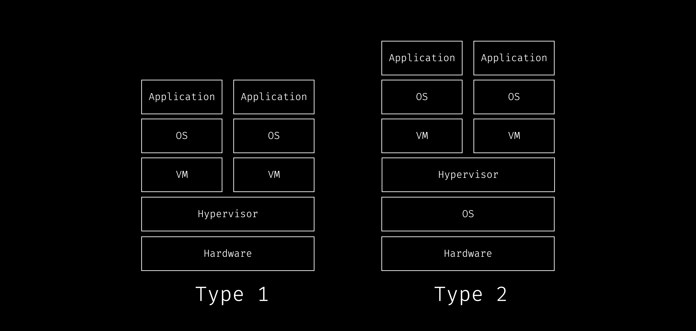

# virtualizacion

La virtualización es la creación de una versión virtual a partir de una versión real de un sistema operativo, hardware, etc.

## Hipervisores o Virtual Machine Manager (VMM)

Los hipervisores toman sus recursos físicos y los dividen para que los entornos virtuales puedan usarlos.

## Tipos hipervisores

### Tipo 1 o hipervisor bare-metal
virtualización del lado del servidor 

se ejecuta directamente en el hardware y actúa como sistema operativo para la máquina física

- Microsoft Hyper-V, VMware, ESX y Citrix Xenserver.

### tipo 2 
virtualización del lado del cliente

existe sobre un sistema operativo existente
