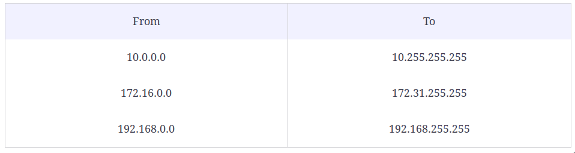
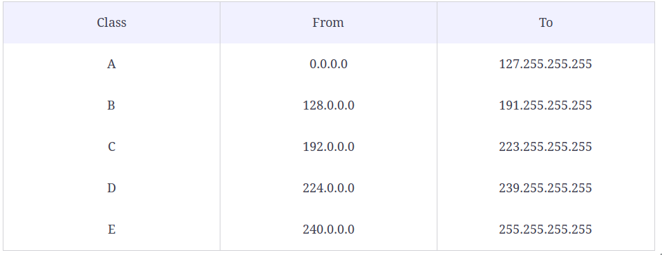

# virtualizacion

[Curso Guia de vagrant Educaative](https://www.educative.io/courses/guide-to-vagrant-virtual-machines)

La virtualización es la creación de una versión virtual a partir de una versión real de un sistema operativo, hardware, etc.

## Hipervisores o Virtual Machine Manager (VMM)

Los hipervisores toman sus recursos físicos y los dividen para que los entornos virtuales puedan usarlos.

## Tipos hipervisores


### Tipo 1 o hipervisor bare-metal
virtualización del lado del servidor 

se ejecuta directamente en el hardware y actúa como sistema operativo para la máquina física

- Microsoft Hyper-V, VMware, ESX y Citrix Xenserver.

### tipo 2 
virtualización del lado del cliente

existe sobre un sistema operativo existente

- vagrant

## 🔥 Vagrant
[Imagenes](https://app.vagrantup.com/boxes/search)

Con Vagrant, puede instalar cualquier sistema operativo virtual usando la CLI (Interfaz de línea de comandos), ejecutarlo, trabajar un poco y apagarlo.

Para usarlo debemos tener instalado algun VirtualBox, VMware, libvirt (Linux), etc.

puede crear varias máquinas dentro de una sola Vagrantfilepara comprobar cómo funciona su aplicación en diferentes entornos

### Instalacion
```bash
$ sudo apt-get install vagrant
```

### Proceso de uso

- buscamos la imagen que queremos en [Vagrand cloud](https://app.vagrantup.com/boxes/search) solo necesitamos el nombre
```bash
# inicializa el entorno y crea el Vagrantfile
$ vagrant init nombre/imageourl

# crea y configura la maquina virtual
$ vagrant up [opcional nombre o id]

# ver el esatdo de las imagenes
$ vagrant status [name|id]

```
- Se descargara la imagen y se levantara
- para conectarnos debemos escribir `$ vagrant ssh`

Otros comandos

```bash
# tbn podemos iniciar vagrant con configuraciones minimas
$ vagrant init --minimal
# creara el Vagrantfile al abrir modificar `config.vm.box = "base"` cambiar base por el nombre de la imagen

# intenta un apagado
$ vagrant halt [name|id]

# remove la maquina
$ vagrant destroy [name|id]

# suspende la maquina
$ vagrant suspend [name|id]

# levanta un suspendido
$ vagrant resume [name|id]

# descargar la imagen de la nube y lo guarda en tu maquina local no crea el Vagrant file
$ vagrant box add name/img

# ver todo el stado
$ vagrant global-status

```
### Vagrantfile
archivo de configuración para su VM escrito en ruby


**Aprovisonamiento**
El término "aprovisionamiento" significa hacer que los recursos estén disponibles antes de iniciar la VM

```ruby
$httpd = <<SCRIPT
yum install httpd
systemctl start httpd
systemctl enable httpd
SCRIPT
Vagrant.configure("2") do |config|
  config.vm.box = "centos/7"
  config.vm.provision "shell", inline: $httpd
  config.vm.provider "virtualbox" do |vb|
    vb.memory = "1024"
    vb.cpus = "2"
  end
end
```

se creo una variable $hhtpd y luego se llama en provision. Si ya tenemos montado la maquina no se va aprovisionar a menos que usemos `vagrant init --provision` o `vagrant provision name/vm`

tbn podemos aprovisionar archivos sh `config.vm.provision "shell", path: "script.sh"` o sh remotos
`config.vm.provision "shell", path: "https://example.com/script.sh"`

**Compartir carpetas host e invitado**

`config.vm.synced_folder ".", "/home/vagrant/stuff"`

seleccionará todos los archivos o carpetas que están presentes en el directorio actual ".", del sistema operativo host y compartirá todo el contenido dentro del /home/vagrant/stuffdirectorio del sistema operativo invitado. Si la carpeta stuffno existe en la máquina invitada, creará una.

**ejecutar multiples maquinas multi-machine**
```ruby
Vagrant.configure("2") do |config|
  
  config.vm.define "node1", primary: true do |node1|
    node1.vm.box = "ubuntu/trusty64"
    node1.vm.hostname = "webserver"
  end
 
  config.vm.define "node2" do |node2|
    node2.vm.box = "centos/7"
    node2.vm.hostname = "database"
  end
end
```

ahora al hacer `vagrant up` se levantaran ambas maquinas, ahora para ingresar los hacemos mediante el hostname `vagrant ssh webserver` si no especificamos el hostname se levantara el que tiene `primary:true`


**configuraciones red**

```ruby
// configurar un host para una red para q lo usen otros de la red
	config.vm.hostname = "server.example.com"
// asignar una direccion ip privada
	config.vm.network "private_network", ip: "192.168.10.1"
// asignar una ip publica y al conectarnos con Vagrant ssh podremos ver a q ip se asigno para conectarnos
	config.vm.network "public_network"
```

## ip privadas



## ip publicas
Las ip de clase A,B, C estan disponibles en internet y son de unidifusion solo un dispositivo se intenta conecta a otra.

Las tipo D son multidifucion es decir pueden conectarme muchos dispositivos son usados para reuniones y no estan disponible en la internet

La clase E es reservado


> Podemos usar Ansible o chef para automatizacion con Vagrant
